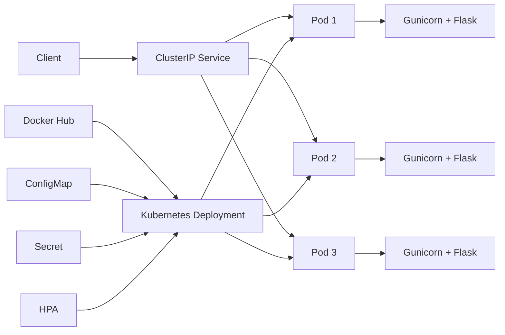

# Employee Management API — Docker & Kubernetes

A production-style Employee Management REST API built with Flask and deployed using Docker and Kubernetes.

This project demonstrates containerization, Kubernetes orchestration, service discovery, health checks, self-healing, horizontal scaling, rolling updates, rollback, configuration management, secrets injection, and container security hardening.

---

## 🚀 Project Overview

The application provides a REST API for managing employee records.

The project was developed to gain hands-on experience with the complete application deployment lifecycle:

```text
Flask REST API
      ↓
Docker Container
      ↓
Docker Hub
      ↓
Kubernetes Deployment
      ↓
Service + Health Probes
      ↓
Self-Healing + Scaling
      ↓
HPA
      ↓
Rolling Updates + Rollback
      ↓
ConfigMap + Secret
      ↓
Non-Root Container


---

## 🏗️ Architecture



### Deployment Architecture

- **Flask** provides the Employee Management REST API.
- **Gunicorn** runs the Flask application as the production WSGI server.
- **Docker** packages the application and its dependencies into an image.
- **Docker Hub** stores the versioned container image.
- **Kubernetes Deployment** manages three application replicas.
- **ClusterIP Service** provides internal service discovery and load balancing.
- **Readiness Probe** controls when a Pod receives traffic.
- **Liveness Probe** allows Kubernetes to detect unhealthy containers.
- **HPA** automatically adjusts replicas based on CPU utilization.
- **ConfigMap** provides non-sensitive application configuration.
- **Secret** injects sensitive configuration into the Pod.
- The container runs as a **non-root user** for improved container security.

---

## 🛠️ Technology Stack

| Technology | Purpose |
|---|---|
| Python | Application development |
| Flask | REST API framework |
| Gunicorn | Production WSGI server |
| Docker | Application containerization |
| Docker Hub | Container image registry |
| Kubernetes | Container orchestration |
| Kubernetes Deployment | Replica and rollout management |
| Kubernetes Service | Internal networking and load balancing |
| HPA | Automatic horizontal scaling |
| ConfigMap | Non-sensitive configuration |
| Secret | Sensitive configuration injection |
| YAML | Kubernetes resource definitions |
| Linux / WSL2 | Development environment |

---

## 📦 Project Structure

```text
employee-management-api/
│
├── app.py
├── requirements.txt
├── Dockerfile
├── .dockerignore
├── .gitignore
├── README.md
│
└── k8s/
    ├── deployment.yaml
    ├── service.yaml
    ├── hpa.yaml
    ├── configmap.yaml
    ├── secret.example.yaml
    └── secret.yaml        # local only, ignored by Git

---

## 🔌 API Endpoints

| Method | Endpoint | Description |
|---|---|---|
| GET | `/` | API information and status |
| GET | `/health` | Application health check |
| GET | `/employees` | Get all employees |
| GET | `/employees/<id>` | Get a specific employee |
| POST | `/employees` | Create a new employee |
| PUT | `/employees/<id>` | Update an employee |
| DELETE | `/employees/<id>` | Delete an employee |

### Example Response

```json
{
  "id": 1,
  "name": "Yash",
  "department": "Data Engineering",
  "role": "Data Engineer"
}
```

### Health Check

```bash
curl http://localhost:5000/health
```

Expected response:

```json
{
  "status": "healthy"
}
```

---

## 🐳 Docker

Build the image:

```bash
docker build -t gost0proxy/employee-management-api:1.4 .
```

Run the container:

```bash
docker run -d --name employee-api-v14 -p 5000:5000 gost0proxy/employee-management-api:1.4
```

Test the API:

```bash
curl http://localhost:5000/health
```

View running containers:

```bash
docker ps
```

---

## ☸️ Kubernetes Deployment

Apply the Kubernetes resources:

```bash
kubectl apply -f k8s/configmap.yaml

cp k8s/secret.example.yaml k8s/secret.yaml
# Edit k8s/secret.yaml and replace the placeholder with your local secret

kubectl apply -f k8s/secret.yaml

kubectl apply -f k8s/deployment.yaml
kubectl apply -f k8s/service.yaml
kubectl apply -f k8s/hpa.yaml
```

> `k8s/secret.yaml` is local-only and intentionally excluded from Git. Do not commit real credentials or API keys.

Check the Deployment:

```bash
kubectl get deployment employee-api
```

Check Pods:

```bash
kubectl get pods -l app=employee-api
```

Check the Service:

```bash
kubectl get service employee-api-service
```

Check HPA:

```bash
kubectl get hpa employee-api-hpa
```

---

## 📈 Kubernetes Capabilities Demonstrated

- **3-replica Deployment**
- **ClusterIP Service**
- **Readiness and liveness probes**
- **Automatic self-healing**
- **Manual replica scaling**
- **Horizontal Pod Autoscaling**
- **Rolling updates**
- **Deployment rollback**
- **ConfigMap-based configuration**
- **Secret-based environment variable injection**
- **Non-root container execution**
- **CPU and memory resource requests/limits**
- **Gunicorn-based application serving**

---

## 🔄 Version History

| Image | Major change |
|---|---|
| `1.0` | Initial Dockerized API |
| `1.1` | Application version update |
| `1.2` | Gunicorn production server |
| `1.3` | ConfigMap-aware application configuration |
| `1.4` | Non-root container hardening |

> The Docker image tag represents the deployment/image iteration. The API response currently reports application version `1.1`.

---

## 👨‍💻 Author

**Yash Singh**

This project was built as a hands-on learning project covering Docker containerization and Kubernetes deployment practices.
